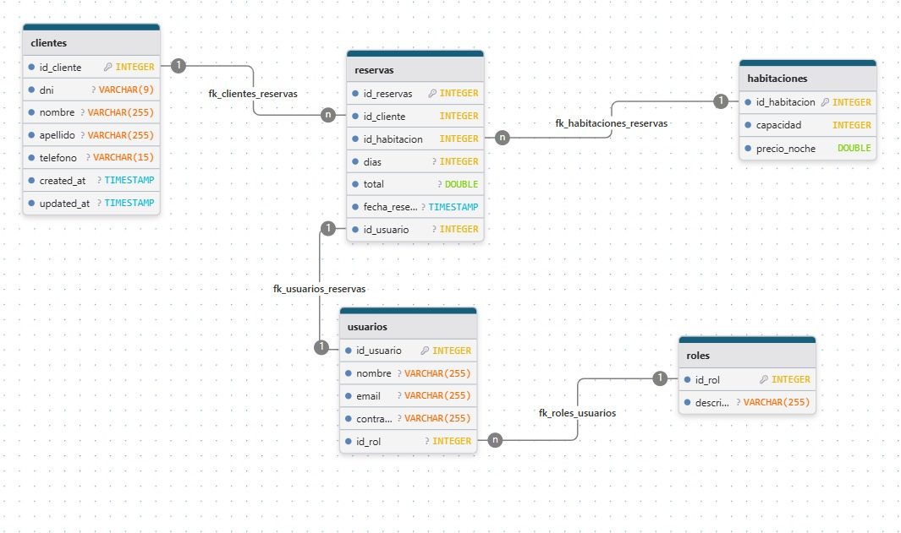

# Sistema de Gestión de Hotel - Full Stack

## 📋 Descripción

Sistema completo de gestión de hotel desarrollado con **Spring Boot** (Backend) y **React + TypeScript** (Frontend). Permite la gestión integral de clientes, habitaciones, reservas, usuarios y roles del hotel.

## 🛠️ Tecnologías Utilizadas

### Backend (Spring Boot)
- **Java**
- **Spring Boot**
- **Hybernate (JPARepository)**
- **MySQL Database**
- **Maven**

### Frontend (React)
- **React 18**
- **TypeScript**
- **Vite**
- **React Router DOM**
- **Axios**
- **CSS Modules**

---
## Estructura de la Base de Datos


### Explicación de las Relaciones

- **Un cliente puede tener muchas reservas:**
  - La tabla `clientes` se relaciona con la tabla `reservas` mediante la clave foránea `id_cliente`. Un cliente puede estar asociado a varias reservas, pero cada reserva pertenece a un solo cliente.

- **Una habitación puede tener muchas reservas:**
  - La tabla `habitaciones` se relaciona con la tabla `reservas` mediante la clave foránea `id_habitacion`. Una habitación puede ser reservada muchas veces a lo largo del tiempo, pero cada reserva corresponde a una sola habitación.

- **Un usuario puede tener muchas reservas:**
  - La tabla `usuarios` se relaciona con la tabla `reservas` mediante la clave foránea `id_usuario`. Un usuario (por ejemplo, un recepcionista) puede gestionar muchas reservas, pero cada reserva es gestionada por un solo usuario.

- **Un rol puede tener muchos usuarios:**
  - La tabla `roles` se relaciona con la tabla `usuarios` mediante la clave foránea `id_rol`. Un rol (por ejemplo, Administrador, Recepcionista) puede estar asignado a varios usuarios, pero cada usuario tiene un solo rol.

- **Resumen:**
  - Todas las relaciones principales son de tipo **uno a muchos** (`1:N`), donde la entidad del lado "uno" puede estar asociada a muchas entidades del lado "muchos".

---

## 📁 Estructura del Proyecto

```
fullstack-spring-hotel/
├── spring-boot-reservas/          # Backend Spring Boot
│   ├── src/main/java/com/santicue/reservas/
│   │   ├── controller/            # Controladores REST
│   │   ├── service/              # Lógica de negocio
│   │   ├── repository/           # Acceso a datos
│   │   ├── model/                # Entidades JPA
│   │   └── config/               # Configuraciones
│   └── src/main/resources/
│       └── application.properties # Configuración de BD
├── frontend-hotel/                # Frontend React
│   ├── src/
│   │   ├── components/           # Componentes reutilizables
│   │   ├── features/             # Módulos de funcionalidad
│   │   ├── contexts/             # Contextos de React
│   │   ├── hooks/                # Hooks personalizados
│   │   └── models/               # Tipos TypeScript
│   └── public/                   # Archivos estáticos
└── bdcondatos.sql               # Script de base de datos
```

## 🚀 Instalación y Configuración

### Prerrequisitos
- Java 17 o superior
- Node.js 16 o superior
- MySQL 8.0 o superior
- Maven 3.6 o superior

### 1. Configuración de Base de Datos

```sql
-- Crear la base de datos
CREATE DATABASE hotel_reservas;
USE hotel_reservas;

-- Los datos se cargarán automáticamente gracias a nuestra actual configuración de application.properties
-- Ver archivo: bdcondatos.sql
```


### 2. Configuración del Backend

1. **Navegar al directorio del backend:**
```bash
cd spring-boot-reservas
```

2. **Configurar la base de datos en `application.properties`:**
```properties
spring.datasource.url=jdbc:mysql://localhost:3306/hotel_reservas
spring.datasource.username=tu_usuario
spring.datasource.password=tu_password
spring.datasource.driver-class-name=com.mysql.cj.jdbc.Driver
```

3. **Compilar y ejecutar:**
```bash
Instalar Languaje Support for Java en tu IDE de preferencia
Darle click derecho y Run Java en nuestro ReservasApplication.java

```

El backend ya estaría disponible en: `http://localhost:8080`

### 3. Configuración del Frontend

1. **Navegar al directorio del frontend:**
```bash
cd frontend-hotel
```

2. **Instalar dependencias:**
```bash
npm install
```

3. **Ejecutar en modo desarrollo:**
```bash
npm run dev
```

El frontend estará disponible en: `http://localhost:5173`

## 📊 Funcionalidades

### 🔐 Gestión de Usuarios y Autenticación
- **Login/Logout** de usuarios
- **Gestión de roles** (Admin, Recepcionista, etc.)
- **Validación de permisos** por rol

### 👥 Gestión de Clientes
- **Crear, editar, eliminar** clientes
- **Validación de DNI** único
- **Búsqueda y listado** de clientes
- **Campos requeridos**: DNI, nombre, apellido

### 🏨 Gestión de Habitaciones
- **Crear, editar, eliminar** habitaciones
- **Validación de número** único
- **Tipos de habitación** (Individual, Doble, Suite)
- **Estados** (Disponible, Ocupada, Mantenimiento)
- **Precio por noche** y capacidad

### 📅 Gestión de Reservas
- **Crear, editar, eliminar** reservas
- **Asociación** cliente-habitación-usuario
- **Cálculo automático** de total por días
- **Validación de fechas** y disponibilidad

## 🔧 API Endpoints

### Autenticación
- `POST /api/usuarios/login` - Login de usuario

### Clientes
- `GET /api/clientes` - Listar todos los clientes
- `GET /api/clientes/{id}` - Obtener cliente por ID
- `POST /api/clientes` - Crear nuevo cliente
- `PUT /api/clientes/{id}` - Actualizar cliente
- `DELETE /api/clientes/{id}` - Eliminar cliente

### Habitaciones
- `GET /api/habitaciones` - Listar todas las habitaciones
- `GET /api/habitaciones/{id}` - Obtener habitación por ID
- `POST /api/habitaciones` - Crear nueva habitación
- `PUT /api/habitaciones/{id}` - Actualizar habitación
- `DELETE /api/habitaciones/{id}` - Eliminar habitación

### Reservas
- `GET /api/reservas` - Listar todas las reservas
- `GET /api/reservas/{id}` - Obtener reserva por ID
- `POST /api/reservas` - Crear nueva reserva
- `PUT /api/reservas/{id}` - Actualizar reserva
- `DELETE /api/reservas/{id}` - Eliminar reserva

### Usuarios
- `GET /api/usuarios` - Listar todos los usuarios
- `GET /api/usuarios/{id}` - Obtener usuario por ID
- `POST /api/usuarios` - Crear nuevo usuario
- `PUT /api/usuarios/{id}` - Actualizar usuario
- `DELETE /api/usuarios/{id}` - Eliminar usuario

### Roles
- `GET /api/roles` - Listar todos los roles
- `GET /api/roles/{id}` - Obtener rol por ID
- `POST /api/roles` - Crear nuevo rol
- `PUT /api/roles/{id}` - Actualizar rol
- `DELETE /api/roles/{id}` - Eliminar rol

## 🏗️ Arquitectura MVC

### Backend (Spring Boot)
- **Arquitectura en capas**:
  - **Controller**: Maneja peticiones HTTP y respuestas
  - **Service**: Contiene la lógica de negocio y validaciones
  - **Repository**: Acceso a datos con Spring Data JPA (ORM)
  - **Model**: Entidades JPA para mapeo de base de datos

### Frontend (React)
- **Arquitectura modular**:
  - **Features**: Módulos por funcionalidad (clientes, habitaciones, etc.)
  - **Components**: Componentes reutilizables
  - **Contexts**: Estado global de la aplicación
  - **Hooks**: Lógica reutilizable

## 🔒 Validaciones y Seguridad

### Validaciones de Backend
- **Campos requeridos** en todas las entidades
- **Validación de unicidad** (DNI, email, número de habitación)
- **Validación de valores positivos** (precios, días, capacidad)
- **Verificación de existencia** en operaciones de update/delete

### Manejo de Errores
- **Excepciones personalizadas** con mensajes descriptivos
- **Respuestas HTTP apropiadas** (400, 404, 500)
- **Logging** de errores para debugging


## 📝 Notas de Desarrollo

### Convenciones de Código
- **Backend**: Nomenclatura camelCase para métodos y variables
- **Frontend**: Nomenclatura camelCase para funciones y variables
- **Base de datos**: Nomenclatura snake_case para tablas y columnas

### Patrones Utilizados
- **Repository Pattern**: Para acceso a datos
- **Service Layer Pattern**: Para lógica de negocio
- **REST API**: Para comunicación cliente-servidor
- **Context API**: Para estado global en React

## 🤝 Contribución

1. Fork el proyecto
2. Crear una rama para tu feature (`git checkout -b feature/AmazingFeature`)
3. Commit tus cambios (`git commit -m 'Add some AmazingFeature'`)
4. Push a la rama (`git push origin feature/AmazingFeature`)
5. Abrir un Pull Request

## 📄 Licencia

Este proyecto está bajo la Licencia MIT. Ver el archivo `LICENSE` para más detalles.

## 👨‍💻 Autor

**Santiago Cuevas**
- GitHub: [@santicue](https://github.com/santicue)

---

## 🆘 Soporte

Si tienes alguna pregunta o problema, por favor:
1. Revisa la documentación
2. Busca en los issues existentes
3. Crea un nuevo issue con detalles del problema

**¡Gracias por usar nuestro sistema de gestión de hotel! 🏨✨** 